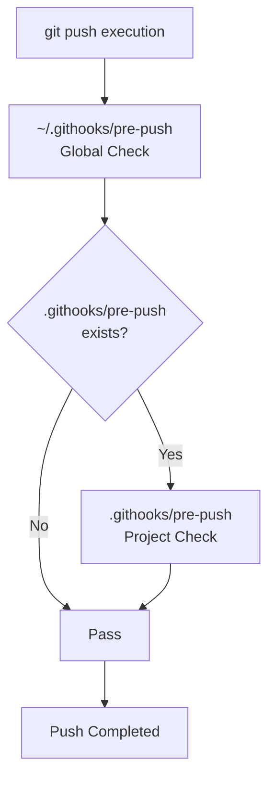

# ai-coding-safety v1.3.0

[한국어](README.md) | [English](README.en.md)

[](CHANGELOG.md)
[](LICENSE)

> A collection of Git hooks to prevent security accidents when collaborating with AI coding assistants.
> Works with all AI coding tools including Claude Code, Gemini CLI, and OpenAI Codex.

## Table of Contents
- [What it Prevents](#what-it-prevents)
- [Ask AI for Setup](#ask-ai-for-setup)
- [Direct Installation](#direct-installation)
- [Structure & Behavior](#structure--behavior)
- [Customization](#customization)
- [Documentation](#documentation)
- [License](#license)

---

## What it prevents

- API keys, passwords, and tokens being accidentally pushed to GitHub.
- Version mismatch across documents like README, CHANGELOG, and dashboard.

### Visual Example

Commits are immediately blocked when a security threat is detected:

```text
🚨 COMMIT BLOCKED
--------------------------------------------------
❌ Sensitive data detected in: config/secrets.json
❌ Pattern: app_key.*['\"]PS[a-zA-Z0-9]{30,}['\"]

💡 Please remove the credentials or add them to .gitignore
--------------------------------------------------
```

---

## Ask AI for setup

**Just tell your AI with this repository URL:**

```
https://github.com/20eung/ai-coding-safety - Refer to this and set it up for my project
```

AI will automatically:
1. Check global hook status → Install if missing
2. Check project hook status → Install if missing
3. Verify and commit

> `AGENTS.md` — AI-readable auto-installation instructions
> `CLAUDE.md` — For Claude Code
> `GEMINI.md` — For Gemini CLI

---

## Direct Installation

### Global Hooks (Computer-wide, first time only)

```bash
bash <(curl -fsSL https://raw.githubusercontent.com/20eung/ai-coding-safety/main/scripts/install-global.sh)
```

Security checks will be automatically applied to all git repositories.

### Project Hooks (Run in project root)

```bash
bash <(curl -fsSL https://raw.githubusercontent.com/20eung/ai-coding-safety/main/scripts/install-project.sh)
```

---

## Structure & Behavior

| Type | Global Hooks (`~/.githooks/`) | Project Hooks (`.githooks/`) |
| :--- | :--- | :--- |
| **pre-commit** | Common security patterns (.pem, .key, .env, API keys, etc.) | Project-specific file and pattern blocking |
| **pre-push** | Project hook chaining | Version consistency check (based on `version.json`) |

### Chaining Flow



---

## GitHub Release

`scripts/release.sh` is also installed when project hooks are set up.

```bash
bash scripts/release.sh          # Release with version from version.json
bash scripts/release.sh v1.2.3   # Specify version directly
```

Using `gh release create` directly skips version checks.
Always release through `release.sh`.

---

## Customization

Modify files after installation to suit your project:

- `.githooks/pre-commit` → Add files/patterns to block
- `.githooks/pre-push` → Set version file path and target documents

Details: [docs/customization.md](docs/customization.md)

---

## Documentation

- [Why Git Hooks are Needed](docs/why-hooks.md) — Background for Vibe Coders
- [Customization Guide](docs/customization.md) — How to configure per project
- [AGENTS.md](AGENTS.md) — AI auto-install instructions (full procedure)

---

## File List

| File | Description |
|---|---|
| `global/pre-commit` | Global security check hook |
| `global/pre-push` | Global chaining hook |
| `project/pre-commit` | Project hook template |
| `project/pre-push` | Version consistency check template |
| `project/release.sh` | Release script template |
| `scripts/install-global.sh` | Global hook install script |
| `scripts/install-project.sh` | Project hook install script |
| `AGENTS.md` | AI auto-install instructions (Common) |
| `CLAUDE.md` | Claude Code specific instructions |
| `GEMINI.md` | Gemini CLI specific instructions |

---

## Contributing

Bug reports and feature suggestions are always welcome! Please open an Issue or submit a Pull Request.

## License

This project is licensed under the [MIT License](LICENSE).
