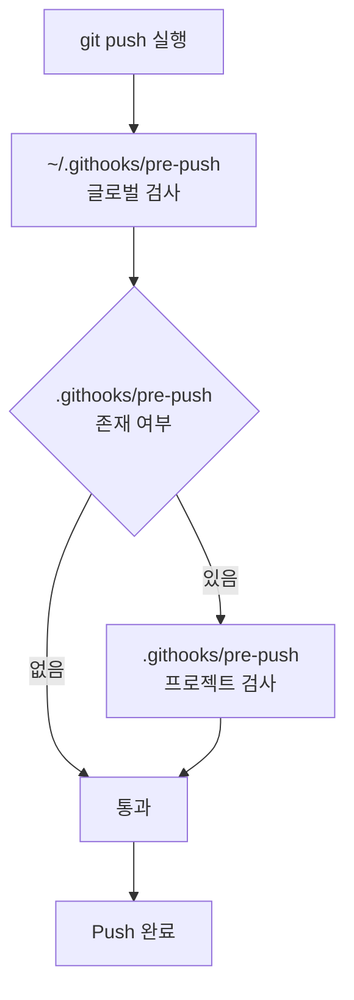

# ai-coding-safety v1.3.2

[한국어](README.md) | [English](README.en.md)

[](CHANGELOG.md)
[](LICENSE)

> AI 코딩 어시스턴트와 협업할 때 발생하는 보안 사고를 방지하는 Git 훅 모음입니다.
> Claude Code, Gemini CLI, OpenAI Codex 등 모든 AI 코딩 도구에서 동작합니다.

## 목차
- [이런 사고를 막아줍니다](#이런-사고를-막아줍니다)
- [AI에게 설정 요청하기](#AI에게-설정-요청하기)
- [직접 설치하기](#직접-설치하기)
- [구조 및 동작](#구조-및-동작)
- [커스터마이징](#커스터마이징)
- [문서](#문서)
- [라이선스](#라이선스)

---

## 이런 사고를 막아줍니다

### 1. 보안 점검 (Security Check)
- API 키, 비밀번호, 프라이빗 키 등이 실수로 GitHub에 푸시되는 것을 방지합니다.
- `pre-commit` 단계에서 감지하여 커밋 자체를 차단합니다.

#### 시각적 예시 (Visual Example)
보안 위협이 감지되면 커밋이 즉시 차단됩니다:

```text
🚨 COMMIT BLOCKED
--------------------------------------------------
❌ Sensitive data detected in: config/secrets.json
❌ Pattern: app_key.*['\"]PS[a-zA-Z0-9]{30,}['\"]

💡 Please remove the credentials or add them to .gitignore
--------------------------------------------------
```

### 2. 버전 일관성 검사 (Version Consistency Check)
- `version.json`을 기준으로 README, CHANGELOG 등의 버전 표기가 일치하는지 검수합니다.
- 버전이 하나라도 다르면 `git push`를 상시 차단하여 문서 간 불일치를 방지합니다.

#### 시각적 예시 (Visual Example)
버전 불일치가 감지되면 푸시가 즉시 차단됩니다:

```text
🔖 버전 일관성 검사 중...
   기준 버전: v1.3.0 (from version.json)

   ✅ README.md
   ❌ README.en.md
      → ENG README 제목 에 v1.3.0 이 없습니다.
   ✅ CHANGELOG.md

━━━━━━━━━━━━━━━━━━━━━━━━━━━━━━━━━━━━━━━━━━━━━━━━━━
❌ 버전 불일치 — 푸시가 차단되었습니다.

   위 파일들을 v1.3.0 로 업데이트한 뒤 다시 push 하세요.
━━━━━━━━━━━━━━━━━━━━━━━━━━━━━━━━━━━━━━━━━━━━━━━━━━
```

---

## AI에게 설정 요청하기

**이 저장소 URL을 AI에게 알려주고 이렇게 말하면 됩니다:**

```
https://github.com/20eung/ai-coding-safety 참고해서 내 프로젝트에 설정해줘
```

AI가 자동으로:
1. 글로벌 훅 설치 여부 확인 → 없으면 설치
2. 프로젝트 훅 설치 여부 확인 → 없으면 설치
3. 동작 확인 및 커밋

> `AGENTS.md` — AI가 읽는 자동 설치 지침서
> `CLAUDE.md` — Claude Code 전용
> `GEMINI.md` — Gemini CLI 전용

---

## 직접 설치하기

### 글로벌 훅 (컴퓨터 전체, 최초 1회)

```bash
bash <(curl -fsSL https://raw.githubusercontent.com/20eung/ai-coding-safety/main/scripts/install-global.sh)
```

모든 git 저장소에 보안 검사가 자동 적용됩니다.

### 프로젝트 훅 (프로젝트 루트에서 실행)

```bash
bash <(curl -fsSL https://raw.githubusercontent.com/20eung/ai-coding-safety/main/scripts/install-project.sh)
```

---

## 구조 및 동작

| 구분 | 글로벌 훅 (`~/.githooks/`) | 프로젝트 훅 (`.githooks/`) |
| :--- | :--- | :--- |
| **pre-commit** | 공통 보안 패턴 검사 (.pem, .key, .env, API 키 등) | 프로젝트 전용 파일 및 패턴 차단 |
| **pre-push** | 프로젝트 훅 체이닝 | 버전 일관성 검사 (`version.json` 기준) |

### 체이닝 동작 방식



---

## GitHub 릴리즈

프로젝트 훅 설치 시 `scripts/release.sh`도 함께 설치됩니다.

```bash
bash scripts/release.sh          # version.json 버전으로 릴리즈
bash scripts/release.sh v1.2.3   # 버전 직접 지정
```

`gh release create` 를 직접 사용하면 버전 검사가 우회됩니다.
항상 `release.sh` 를 통해 릴리즈하세요.

---

## 커스터마이징

설치 후 프로젝트에 맞게 수정하세요.

- `.githooks/pre-commit` → 차단할 파일/패턴 추가
- `.githooks/pre-push` → 버전 파일 경로 및 검사 대상 문서 설정

자세한 내용: [docs/customization.md](docs/customization.md)

---

## 문서

- [왜 Git 훅이 필요한가](docs/why-hooks.md) — 바이브코더를 위한 배경 설명
- [커스터마이징 가이드](docs/customization.md) — 프로젝트별 설정 방법
- [AGENTS.md](AGENTS.md) — AI 자동 설치 지침서 (전체 절차)

---

## 파일 목록

| 파일 | 설명 |
|---|---|
| `global/pre-commit` | 글로벌 보안 검사 훅 |
| `global/pre-push` | 글로벌 체이닝 훅 |
| `project/pre-commit` | 프로젝트 훅 템플릿 |
| `project/pre-push` | 버전 일관성 검사 템플릿 |
| `project/release.sh` | 릴리즈 스크립트 템플릿 |
| `scripts/install-global.sh` | 글로벌 훅 설치 스크립트 |
| `scripts/install-project.sh` | 프로젝트 훅 설치 스크립트 |
| `AGENTS.md` | AI 자동 설치 지침 (모든 AI 공통) |
| `CLAUDE.md` | Claude Code 전용 지침 |
| `GEMINI.md` | Gemini CLI 전용 지침 |

---

## 기여하기

버그 제보나 기능 제안은 언제나 환영합니다! Issue를 남겨주시거나 Pull Request를 보내주세요.

## 라이선스

이 프로젝트는 [MIT License](LICENSE)를 따릅니다.
 
 
